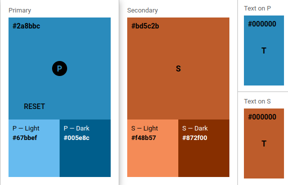
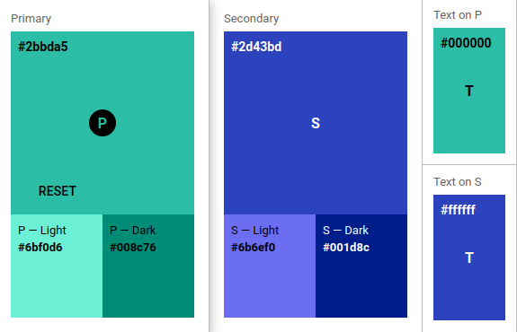
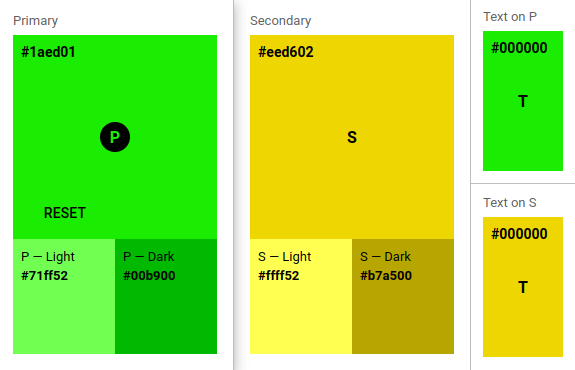
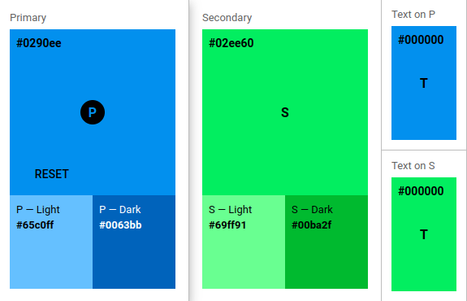
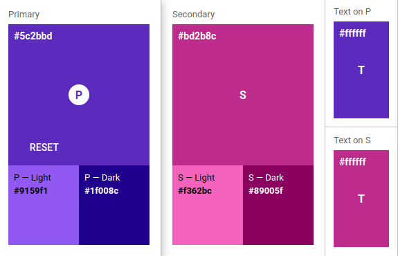
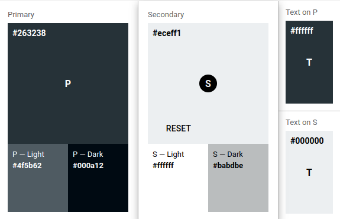

# Software Design & Layout
> **_Design Principles:_**  SRCMS-Apps had to follow some guidelines regarding their design. They are explained in to following sections:
Use the following techniques for development of applications for the SRCMS.


## Software-Design

Here design principles for you programmin code and style are described.<br>
If not marked as optional, you must use these design principles for your applications, to develop reliable application code.

### Fragments & Activities

Use fragments to display our app content pages. Use activities only for seperate use cases.

For example if you develop a quiz app, display the layouts content using different Fragments and Activities for different types of the quiz. Maybe one
for questions about animals (Animal Quiz) and one about Cities (City Quiz). Use the Activities for developing slightly different logic types of the game.
But! Do not use Activities to implement different preferences, like easy and difficult games. These are only modifications, that can be applied to any
type of application (for example both game type, Animals and Cities).

Activities are a unique logic type of your applications, for different types of the same base application or maybe different audiences.

See: https://developer.android.com/guide/fragments

### Navigation Graph
Use the navigation graph to navigate easily between fragments

See: https://developer.android.com/guide/navigation/navigation-getting-started

### View Binding 
You can use the Android data binding library, to create bindings that make the access of UI elements easier. It creates variables to access the UI
elements. For larger number of UI elements, this makes it easiery an more reliable to use these UI elements.

See: https://developer.android.com/topic/libraries/view-binding

### View Models (optional)
To store your data, use view models.

View models are UI-related objects that can hold the data you require for our UI changes and application process. They consist over different
Fragments and are correctly handled inside the Android lifecycle.

See: https://developer.android.com/topic/libraries/architecture/viewmodel

### Settings (optional)
To save app specific settings, use a preference object.
Define your available settinsg using a xml resource and inflate them into a settings fragment.

Then you can use the via the shared preference interface.

See: https://developer.android.com/develop/ui/views/components/settings

### General Android Software Design
To garantue a stable appliction as long as possible, follow these guidelines:

* Always target the latest Android API version with your app
* Always use the latest version for build tools
* Always update to the latest version of dependencies
* Implement new concepts and re-develop deprecated functions as soon as possible
* Try to remove warnings on code and rescource files
* Try to leave no open ToDos in release versions of your application
* Always seperated rescource types. For example keep track of ui-strings in a seperate resource file. Do the same with for example
dimensions and colors.

## UI Design

Here you will find design priciples for the user interface design.

Some of the principles apply in general to all apps, some only apply in special purposes. So which you apply to your application, depends on the
purpose of your application.

### Colors

Basicly you are free to use any color set you want to use for your app. But for better integration we recommend to following some rules regarding the
used color:

* Do not use signaling colors, like red, or orange
* Always use a good contrast. So no bright text on bright background
* Don't use rainbow colors inside your app. Therefor use as less as possible colors.
* Use the same color, for all elements with of the same type. For sub-elements, representating a slightly different function, use another color of
the same base color.<br>
For example, for a regular button use a bright blue. For a settings button, that is mainly has not the same function, than other regular buttons,
use birht-light blue or a lite gray.

The SRCMS has a basic theming you can also use for your app.
Simply use the folloring code as our colors.xml in your apps rescources:

```
<resources>
	<color name="primaryColor">#2b8cbd</color>
	<color name="primaryLightColor">#68bcf0</color>
	<color name="primaryDarkColor">#005f8d</color>
	<color name="secondaryColor">#bd5c2b</color>
	<color name="secondaryLightColor">#f48b57</color>
	<color name="secondaryDarkColor">#872f00</color>
	<color name="primaryTextColor">#000000</color>
	<color name="secondaryTextColor">#000000</color>
	<color name="black">#FF000000</color>
	<color name="white">#FFFFFFFF</color>
</resources>
```

You can also follow the links to material.io to see some predifined color sets, suitable for the SRCMS. You only need to replace the values from the
links, with them inside your _colors.xml_:

#### Default Colors (SRCMS Main System & Demo)



#### Analogous Mint Colors



#### Analogous Green (Fun /  Games)



#### Analogous Blue (Communication)



#### Triadic Colors (Therapy)



#### Black & White (Dementia)



#### Theme
To apply the colors above to your application your _themes.xml_ must use the following (delete any othe theme, it will not be used):
```
<resources xmlns:tools="http://schemas.android.com/tools">
<!-- Base application theme. -->
<style name="Theme.SocialRobotCMS" parent="Theme.MaterialComponents.Light">
  <!-- Primary brand color. -->
  <item name="colorPrimary">@color/primaryColor</item>
  <item name="colorPrimaryVariant">@color/primaryDarkColor</item>
  <item name="colorOnPrimary">@color/primaryTextColor</item>
  <!-- Secondary brand color. -->
  <item name="colorSecondary">@color/secondaryColor</item>
  <item name="colorSecondaryVariant">@color/secondaryDarkColor</item>
  <item name="colorOnSecondary">@color/secondaryTextColor</item>
  <!-- Status bar color. -->
  <item name="android:statusBarColor">?attr/colorPrimaryVariant</item>
  <!-- Customize your theme here. -->
  <item name="windowActionBar">false</item>
  <item name="windowNoTitle">true</item>
  <item name="android:buttonStyle">@style/SocialRootCMSButtonPrimary</item>
</style>
<!-- Button Styles -->
<style name="SocialRootCMSButtonPrimary" parent="Widget.AppCompat.Button">
  <item name="backgroundTint">@color/primaryColor</item>
  <item name="android:textColor">@color/primaryTextColor</item>
</style>
<style name="SocialRootCMSButtonPrimaryLight" parent="Widget.AppCompat.Button">
  <item name="backgroundTint">@color/primaryLightColor</item>
  <item name="android:textColor">@color/primaryTextColor</item>
</style>
<style name="SocialRootCMSButtonSecondary" parent="Widget.AppCompat.Button">
  <item name="backgroundTint">@color/secondaryColor</item>
  <item name="android:textColor">@color/secondaryTextColor</item>
</style>
<style name="SocialRootCMSButtonSecondaryLight" parent="Widget.AppCompat.Button">
  <item name="backgroundTint">@color/secondaryLightColor</item>
  <item name="android:textColor">@color/secondaryTextColor</item>
</style>
</resources>
```

To apply the custom style above, set the style attribute of each widget in your app, regarding the following rules:

#### Buttons

* **SocialRootCMSButtonPrimary**
Default button style. Should be used for button the user can safely interact with.

* **SocialRootCMSButtonPrimaryLight**
Style for normal buttons, but with slightly different access. For access of settings or other things. These buttons should only be visible, when
a user priviledged to access the buttons functions, is logged in. So they mark default interactions, but are only visible to specific users.

* **SocialRootCMSButtonSecondary**
Another default button style. Use this for special functions the user should pay attention to. This can be deleting or adding elements. Special
elements, that maybe change over time or that are depending on the systems status.

* **SocialRootCMSButtonSecondaryLight**
As the light style of the primary button, this ist for secondary options for privileged users, logged in. But as normal secondary button style, for
functions, the user should pay attention for.